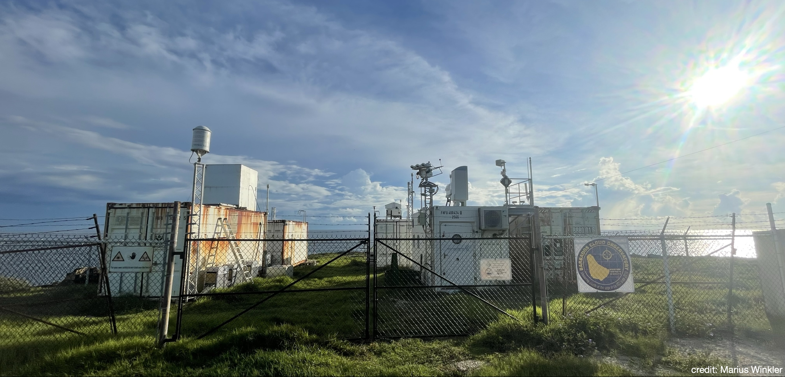
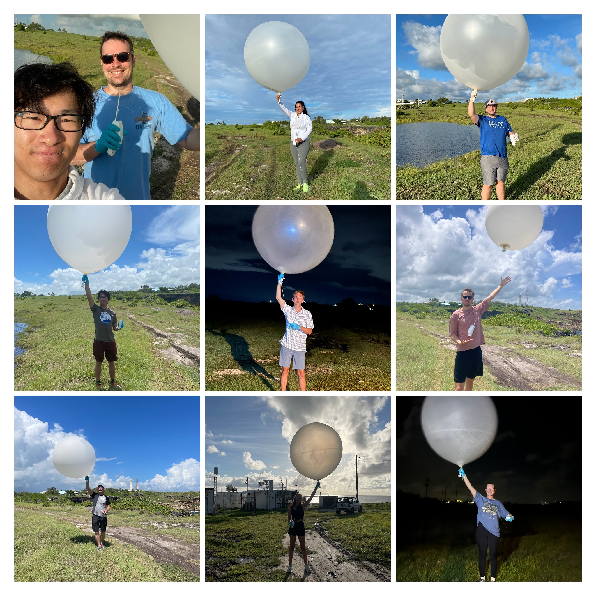
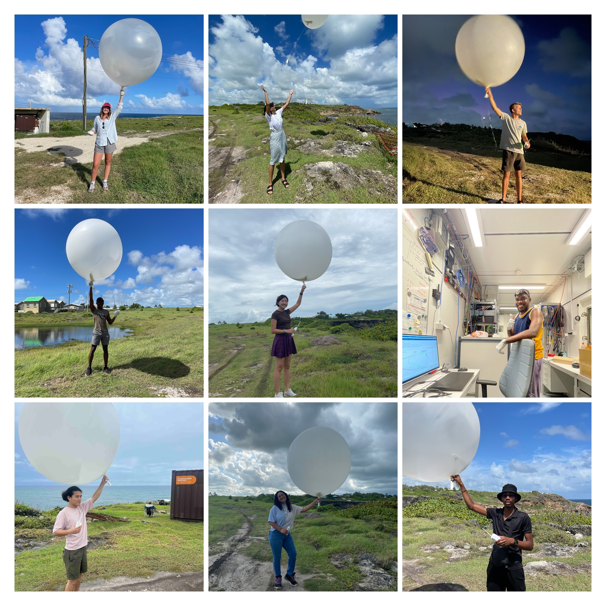

<!-- This file was created automatically -->

# BCO: Radiosondes

This section introduces the data collected from radiosondes during the ORCESTRA campaign. The goal is to present an overview of key measurements and offer a preview of potential analyses. 

---

  
<strong>ORCESTRA at BCO:</strong>

  
  <strong>The BCO Radiosonde Team</strong>
   

  |  |  |
  |:---------------------------------:|:---------------------------------:|

  
<strong>ORCESTRA versus EUREC4A:</strong>

  
  Comparison between ORCESTRA and EUREC4A.
   
  

  
<strong>How good was IFS forecasting ?</strong>

  The IFS (Integrated Forecasting System from ECMWF) was utilized throughout the campaign to plan flights and monitor the synoptic situation. Integrated water vapor data was obtained both from the forecasts and radiosondes, enabling direct comparisons to assess the accuracy of both the soundings and the forecasts. Additionally, radiosondes were launched every six hours from Grantley Adams Airport in Barbados. These observations can also be compared with the LAM (Limited Area Model), which was initialized with IFS data and ran continuously during the campaign. Furthermore, HALO flew on the 23rd of September very close to the BCO. We selected the dropsonde that was launched the closest to the BCO, and compared its IWV with the other products.

  All of these datasets are compared in the plot below:
  

  Our observations consistently show higher moisture levels compared to other products. At the BCO, the measurements taken from the airport closely align with the IFS model. Since these observations were made further inland, where land influences may contribute to atmospheric drying, this could explain the consistent moisture difference. Additionally, it seems that the dropsonde and radiosondes measurements are consistent as they show a very similar value on the 23rd of September.

  On Sal, a similar dry bias is observed in the IFS model, which is also reflected in the LAM. This is expected, as the LAM is initialized with IFS data and then runs for 48-hour periods. 

  Overall, despite a consistent moister atmosphere from ou rmeasurements, the trends are well captured by IFS and the LAM, and the IWV values follow closely the African Easterly Waves pattern (see following section).

  
<strong>African Easterly waves passing on top of Sal:</strong>

  As before, IWV is derived from radiosonde measurements. The dates of African Easterly Wave (AEW) passages over Sal have been identified and analyzed to study their impact on IWV. Typically, dry phases are observed ahead of the AEW, followed by more humid conditions after its passage. The wave axis crossing is marked by a sharp increase in moisture. As expected, the cyclonic circulation of the AEW drives dry air southward to the west of the wave axis, while moist air is transported northward to the east, leading to an increase in IWV over Sal.

  Additionally, the top 20% strongest wind events have been highlighted on the plot (dashed gray lines), showing that wind strength generally peaks either before or after the wave. The green line represents equivalent potential temperature, with its minimums occurring after the wave's passage, within the ridge pattern.

  
  

